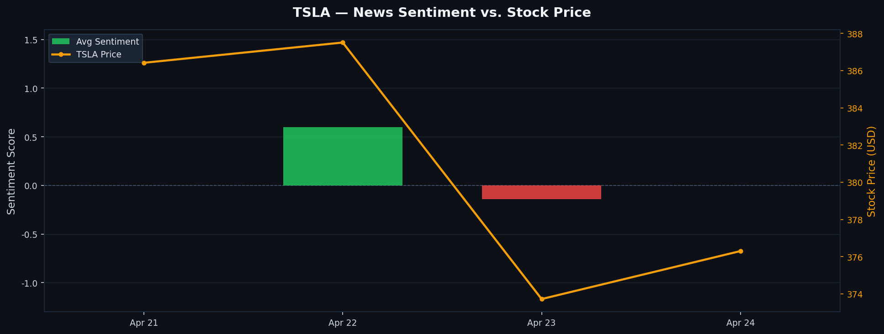
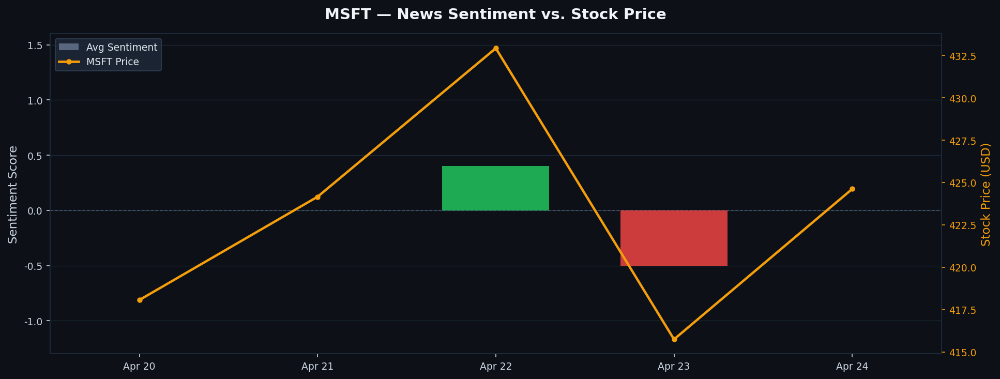

# Financial News Sentiment Pipeline

> A production-style data engineering pipeline that ingests real financial news,
> processes it at scale with Apache Spark, scores sentiment using FinBERT, and
> correlates results with live stock price movements.

[](https://github.com/YOUR_USERNAME/financial-sentiment-pipeline/actions/workflows/ci.yml)


---

## Why This Matters

Financial institutions process millions of news events daily to inform trading decisions,
risk models, and market forecasts. The ability to extract structured sentiment signals from
unstructured text — at scale, in near real-time — is a core capability of modern data
engineering teams at firms like Bloomberg, Two Sigma, and Morgan Stanley. This pipeline
mirrors that workflow end-to-end: from raw API ingestion through distributed processing,
transformer-based NLP inference, and persistent storage, all wired together with
reproducible infrastructure and automated CI/CD. It demonstrates not just familiarity with
individual tools, but the ability to compose them into a coherent, production-minded system.

---

## Sample Output




---

## Architecture

```
NewsAPI
   │
   ▼
src/ingest.py  ──►  /data/raw/          (JSON)
   │
   ▼
src/process.py ──►  /data/processed/    (Parquet)
   │
   ▼
src/sentiment.py ─► /data/sentiment/    (Parquet, partitioned by ticker)
   │                     │
   ▼                     ▼
MongoDB              Matplotlib Charts
(queryable results)  (sentiment vs. price)
```

All stages run on **Apache Spark** via a Dockerized PySpark environment.
FinBERT inference is applied via a `pandas_udf` for vectorized, Spark-native execution.

---

## Tech Stack

| Layer | Technology |
|---|---|
| Distributed Processing | Apache Spark 3.x (PySpark) |
| NLP / Sentiment | FinBERT (`ProsusAI/finbert`) via HuggingFace |
| Data Ingestion | NewsAPI |
| Containerization | Docker + Docker Compose |
| Storage (intermediate) | Apache Parquet |
| Storage (final) | MongoDB |
| Visualization | Matplotlib |
| CI/CD | GitHub Actions |
| Language | Python 3.11 |

---

## Project Structure

```
financial-sentiment-pipeline/
├── docker-compose.yml
├── requirements.txt
├── .github/
│   └── workflows/
│       └── ci.yml
├── assets/
│   ├── GOOGL_sentiment_chart.png
│   └── MSFT_sentiment_chart.png
├── src/
│   ├── ingest.py        # NewsAPI → raw JSON
│   ├── process.py       # PySpark cleaning & transformation
│   ├── sentiment.py     # FinBERT inference via pandas_udf
│   ├── storage.py       # MongoDB writer
│   ├── visualize.py     # Sentiment vs. price charts
│   └── utils.py         # Shared helpers
├── tests/
│   └── test_processing.py
└── README.md
```

---

## Setup & Run

### Prerequisites
- Docker Desktop installed and running
- NewsAPI key (free at [newsapi.org](https://newsapi.org))

### 1. Clone the repo
```bash
git clone https://github.com/YOUR_USERNAME/financial-sentiment-pipeline.git
cd financial-sentiment-pipeline
```

### 2. Configure environment
```bash
# Add your NewsAPI key to .env file after initilizing it
NEWS_API_KEY = 'Your API key'
```

### 3. Start the stack
```bash
docker compose up -d
```

### 4. Open JupyterLab
```bash
docker compose logs spark-notebook
# Copy the token URL and open in browser
```

### 5. Run the pipeline stages
Execute in order inside Jupyter or directly via Python:
```bash
python src/ingest.py       # Fetch news articles
python src/process.py      # Clean & transform with Spark
python src/sentiment.py    # Score sentiment with FinBERT
python src/storage.py      # Persist to MongoDB
python src/visualize.py    # Generate charts
```

---

## Key Spark Concepts Demonstrated

- **DataFrames & lazy evaluation** — transformations build a logical plan; actions trigger execution
- **StructType schemas** — explicit schema definition for reliable JSON ingestion
- **pandas_udf** — vectorized UDFs for efficient ML model inference inside Spark
- **Parquet partitioning** — output partitioned by `ticker` for optimized downstream reads
- **df.explain()** — query plan inspection for understanding Spark execution

---

## CI/CD

GitHub Actions runs on every push to `main`:
- `flake8` lint check across `src/`
- `pytest` unit tests covering schema validation and label correctness

See [`.github/workflows/ci.yml`](.github/workflows/ci.yml).

---

## Tickers Covered

`AAPL` · `MSFT` · `GOOGL` · `TSLA` · `AMZN`
You can change the tickers to whatever you like

---

## Acknowledgements

- [ProsusAI/finbert](https://huggingface.co/ProsusAI/finbert) — Finance-domain BERT model
- [NewsAPI](https://newsapi.org) — News data source
- [yfinance](https://github.com/ranaroussi/yfinance) — Stock price data
